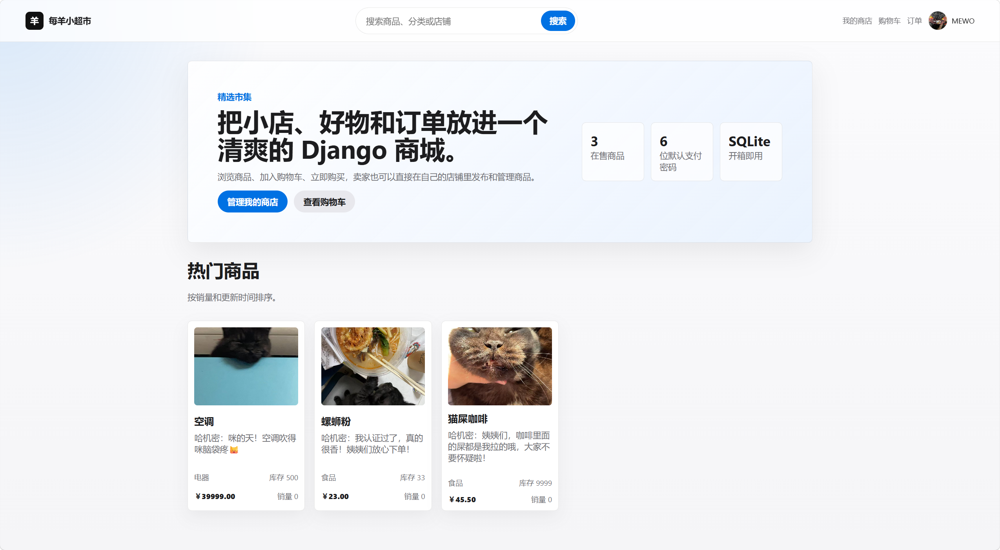
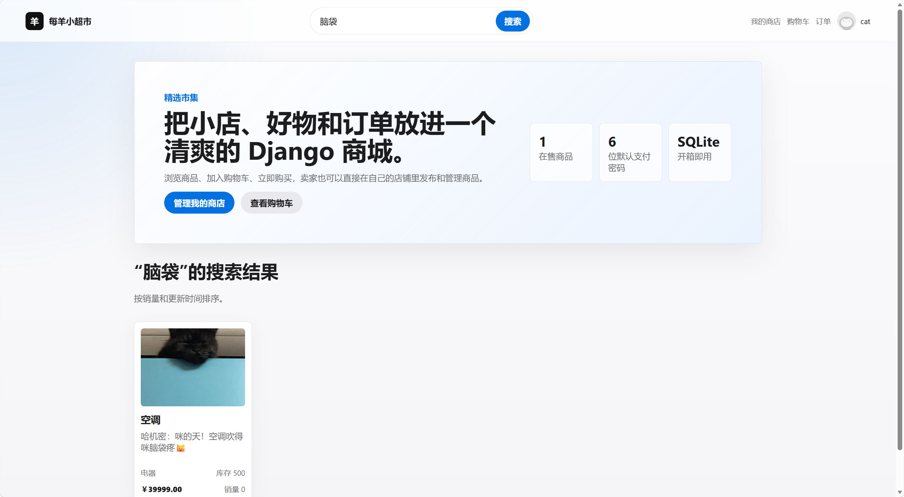
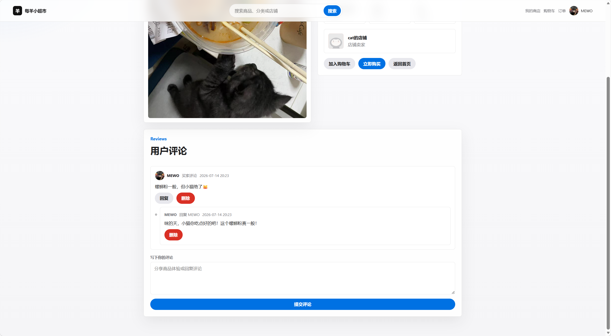
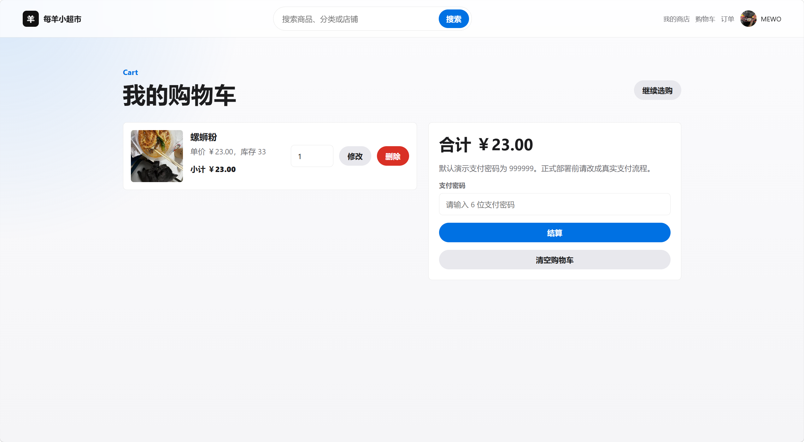
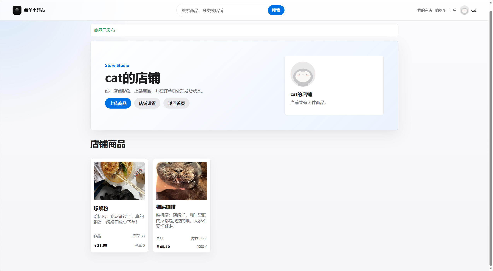
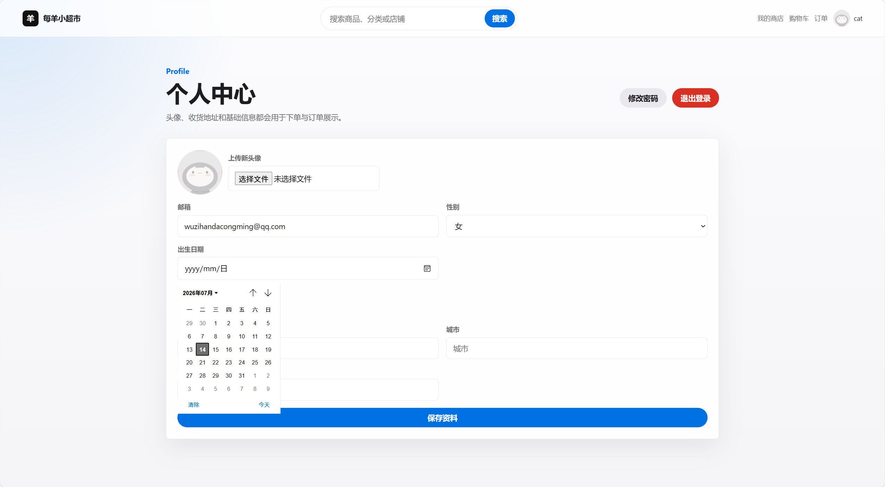
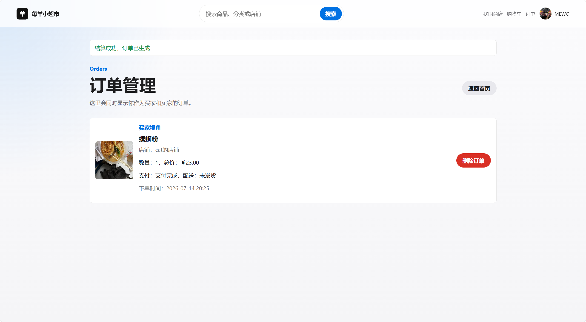
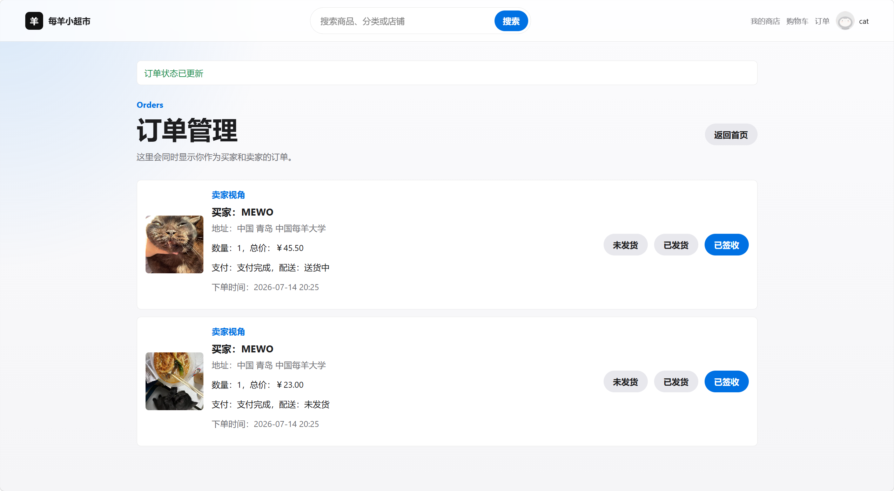

# 每羊小超市 · Django Shopping Website

> 一个适合学习、展示和二次开发的 Django 电商小项目。开箱即用，界面清爽，流程完整，拿来做课程设计、毕设雏形、GitHub Portfolio 都很合适 (๑•̀ㅂ•́)و✧

<p align="center">
  
  
  
  
</p>

## 目录

- [项目介绍](#项目介绍)
- [功能一览](#功能一览)
- [效果展示](#效果展示)
- [技术栈](#技术栈)
- [项目结构](#项目结构)
- [快速开始](#快速开始)
- [默认体验账号与支付说明](#默认体验账号与支付说明)
- [配置 MySQL](#配置-mysql)
- [配置 QQ 邮箱验证码](#配置-qq-邮箱验证码)
- [常用开发命令](#常用开发命令)

## 项目介绍

每羊小超市是一个基于 Django 的轻量商城系统，包含用户、商品、店铺、购物车、支付演示、订单、评论等基础电商流程。项目已经做过一次结构整理：默认不再强制依赖 MySQL，新同学克隆后用 SQLite 就能跑起来；页面也抽出了统一模板和样式，改界面不会到处复制粘贴啦 (｡･ω･｡)

适合这些场景：

- 学 Django 的完整 CRUD、路由、模板、迁移和测试。
- 做课程设计或毕业设计原型。
- 作为个人 GitHub 项目展示。
- 在它的基础上继续扩展真实支付、后台管理、商品分类等功能。

## 功能一览

### 用户侧

- 注册、登录、退出登录。
- 邮箱验证码找回账号。
- 个人资料维护：头像、性别、生日、收货地址。
- 浏览商品、搜索商品、查看商品详情。
- 加入购物车、修改数量、清空购物车。
- 单商品立即购买、购物车批量结算。
- 查看自己的订单。
- 对商品发表评论和回复。

### 卖家侧

- 自动创建个人店铺。
- 店铺名称和头像设置。
- 上传商品：标题、描述、价格、库存、分类、图片。
- 编辑已上架商品。
- 查看卖家订单并更新发货状态。
- 管理自己商品下的评论。

### 工程侧

- 默认 SQLite，快速启动更友好。
- MySQL 可选，适合后续部署或课程要求。
- 邮箱未配置时使用控制台验证码，开发体验更丝滑。
- 支付、库存、订单生成使用事务，避免半成功数据。
- 旧明文密码登录后会自动升级为 Django 哈希密码。
- 提供测试用例，覆盖支付和订单核心逻辑。
- 提供发布压缩包脚本，方便上传到 GitHub Releases。

## 效果展示

从逛商品到下单，再到卖家处理订单，主要页面都保持了同一套清爽的浅色风格。下面是项目实际运行时的截图，页面里的商品和账号都是本地演示数据 (ฅ'ω'ฅ)

### 首页与搜索

| 商城首页 | 商品搜索 |
| :---: | :---: |
|  |  |
| 精选商品、快捷入口和商城状态一目了然。 | 输入关键词即可筛选商品，结果仍保留统一的卡片布局。 |

### 商品与购物车

| 商品详情 | 购物车结算 |
| :---: | :---: |
|  |  |
| 商品信息、所属店铺、评论和回复集中展示。 | 支持调整数量、查看合计，并完成演示支付流程。 |

### 店铺与个人资料

| 店铺主页 | 个人中心 |
| :---: | :---: |
|  |  |
| 卖家可以维护店铺形象，并集中展示已上架商品。 | 头像、联系方式、生日和收货地址都可以在这里维护。 |

### 买家与卖家订单

| 买家视角 | 卖家视角 |
| :---: | :---: |
|  |  |
| 买家可以查看付款、配送状态和订单明细。 | 卖家可以查看订单，并更新发货与签收状态。 |

## 技术栈

| 类型 | 技术 |
| --- | --- |
| 后端框架 | Django 5.1.5 |
| 语言 | Python 3.12+ |
| 默认数据库 | SQLite |
| 可选数据库 | MySQL |
| 页面 | Django Templates |
| 静态样式 | 原生 CSS |
| 图片上传 | Pillow |
| 测试 | Django TestCase |

## 项目结构

```text
.
├── README.md
├── RELEASE_NOTES.md
├── requirements.txt
├── .env.example
├── scripts/
│   └── make_release.py
└── test_market/
    ├── manage.py
    ├── app1/
    │   ├── admin.py
    │   ├── context_processors.py
    │   ├── migrations/
    │   ├── models.py
    │   ├── tests.py
    │   ├── urls.py
    │   └── views.py
    ├── media/
    ├── static/
    │   └── css/styles.css
    ├── templates/
    │   ├── base.html
    │   ├── partials/
    │   ├── home.html
    │   ├── detail.html
    │   └── ...
    └── test_market/
        ├── settings.py
        └── urls.py
```

## 快速开始

### 1. 克隆项目

```bash
git clone https://github.com/qiqiqisi/django-shopping-websites.git
cd django-shopping-websites
```

### 2. 创建虚拟环境

Windows:

```powershell
py -m venv .venv
.\.venv\Scripts\activate
```

macOS / Linux:

```bash
python3 -m venv .venv
source .venv/bin/activate
```

### 3. 安装依赖

```bash
pip install -r requirements.txt
```

如果下载慢，可以临时使用国内镜像：

```bash
pip install -r requirements.txt -i https://pypi.tuna.tsinghua.edu.cn/simple
```

### 4. 初始化数据库

```bash
cd test_market
python manage.py migrate
```

Windows 如果没有 `python` 命令，可以使用：

```powershell
py manage.py migrate
```

### 5. 启动项目

```bash
python manage.py runserver
```

打开浏览器访问：

```text
http://127.0.0.1:8000/
```

看到登录页就说明启动成功啦，芜湖 (ﾉ>ω<)ﾉ

## 默认体验账号与支付说明

项目不会预置固定账号，你可以直接在注册页创建新账号。

开发模式下：

- 如果没有配置真实邮箱，验证码会显示在页面上。
- 新用户会自动生成一个演示钱包。
- 默认支付密码是 `999999`。
- 演示钱包初始余额为 `999999.00`。

> 注意：这是为了课程和本地演示准备的支付流程。正式项目中应该接入真实支付网关，并把支付密码、余额、订单状态做成更严格的安全设计。

## 配置 MySQL

默认 SQLite 足够本地体验。如果你想使用 MySQL，可以这样配置。

### 1. 创建数据库

```sql
CREATE DATABASE market DEFAULT CHARACTER SET utf8mb4 COLLATE utf8mb4_unicode_ci;
```

### 2. 安装 MySQL 驱动

```bash
pip install mysqlclient
```

Windows 如果安装 `mysqlclient` 失败，可以先继续使用 SQLite，等项目跑通后再处理 MySQL 环境。

### 3. 设置环境变量

复制 `.env.example` 为 `.env`，或者直接设置系统环境变量：

```env
DB_ENGINE=mysql
DB_NAME=market
DB_USER=root
DB_PASSWORD=your-password
DB_HOST=127.0.0.1
DB_PORT=3306
```

当前项目默认读取系统环境变量。如果希望自动读取 `.env` 文件，可以自行安装 `python-dotenv` 并在 `settings.py` 中加载。

## 配置 QQ 邮箱验证码

不配置邮箱也能运行。需要真实发送验证码时，设置：

```env
EMAIL_HOST=smtp.qq.com
EMAIL_PORT=587
EMAIL_USE_TLS=True
EMAIL_HOST_USER=your@qq.com
EMAIL_HOST_PASSWORD=your-qq-authorization-code
DEFAULT_FROM_EMAIL=your@qq.com
```

温馨提示：

- `EMAIL_HOST_PASSWORD` 是 QQ 邮箱授权码，不是 QQ 密码。
- 需要在 QQ 邮箱设置里开启 SMTP 服务。
- 本地开发不想配邮箱时，保持为空即可。

## 常用开发命令

```bash
# 检查项目配置
python manage.py check

# 创建迁移
python manage.py makemigrations

# 应用迁移
python manage.py migrate

# 创建后台管理员
python manage.py createsuperuser

# 运行测试
python manage.py test

# 收集静态文件，部署时使用
python manage.py collectstatic
```

后台地址：

```text
http://127.0.0.1:8000/admin/
```

这个项目更偏学习和展示用途。

祝你运行成功，少踩坑，多开心 ٩(ˊᗜˋ*)و
